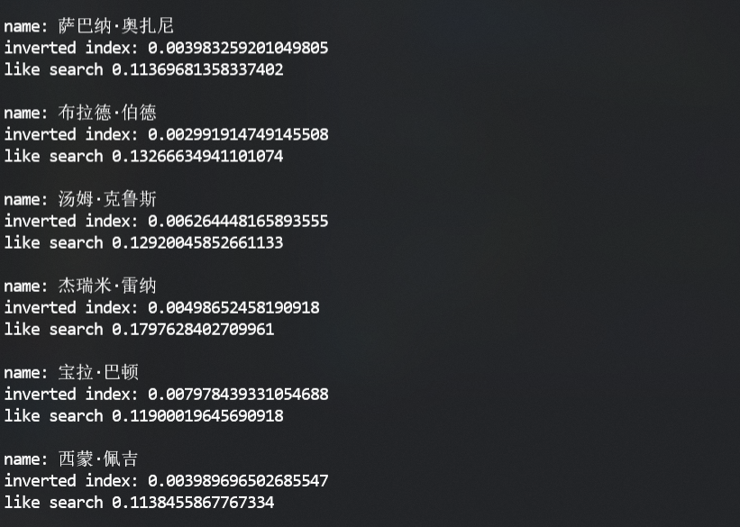
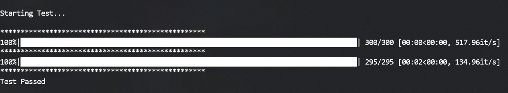

## 小学期实践第三周周报

学号：2017011462 &emsp;&emsp; 姓名：方言

学号：2017011335 &emsp;&emsp; 姓名：何仲凯

### 本周项目进展

1. 完成`hulu视频`信息爬取。

2. 封装了一个用于管理数据库的类，可以实现储存视频信息和更新倒排的功能，在本地进行测试。

   - 每爬取到一个视频信息，为其分配一个`id`，并在视频表中插入该条信息，还需要提取出其`directors`和`actors`的信息，并且在`peopleitem`表中对其更新。

   - 目前本地有`28000`条数据，对比使用模糊搜索和用倒排搜索的性能。

     

     可以看到，使用倒排表查询的速度会远远优于在信息表上使用模糊搜索。

     

3. 实现了一个测试脚本，用于检测视频信息和对应倒排表里信息不一致的情况（这可能是由于爬取时插入数据库失败导致的），并且针对情况进行修复。

   - 测试部分1：随机挑选某个视频，获取其导演和演员信息，判断这些人名对应倒排表中是否存在此视频的`id`
   - 测试部分2：随机挑选某个人名，获取其倒排表中所有的视频`id`，判断这些`id`对应的视频信息中是否存在此人。

   目前仍在本地测试，预计每次爬取若干条之后，就会进行一次测试，并且汇报出现的问题。

   

### 遇到的困难

1. 优酷视频的开放平台审批未通过，直接解析播放页面爬取的信息质量较低，且不完整。
2. 数据库的设计仍有一些不太好扩展的地方，继续查阅资料改进。

### 下周计划

1. 继续完成多个网站具体信息的解析和爬取（分工）
2. 搭建完整爬虫自动更新的流程。
3. 继续优化数据库表结构。